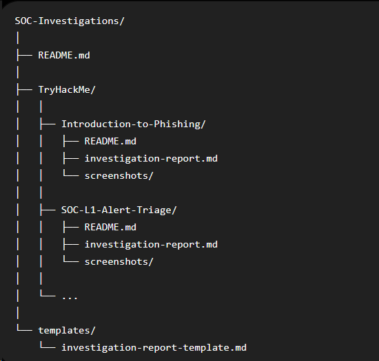

# SOC-Investigations-Simulations
SOC investigation labs and case reports from hands-on simulations across platforms, documenting alert triage, threat analysis, incident response, and SOC workflows.

Expected structure

