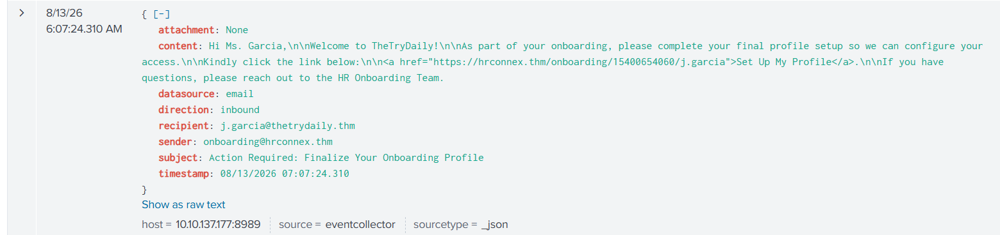

# SOC Investigation Phishing Simulation

TryHackMe Summary: https://tryhackme.com/soc-sim/public-summary/0059eb76552d2959f85f2585e559e7ea301b6aa1f897d2fed5383df2632a3af2f623afda3b34c83fe45a786dcf192219

## **Alert 8814**

Inbound Email Containing Suspicious External Link

Medium

Phishing

Aug 13th 2026 at 07:09

Awaiting action

Description:

This alert was triggered by an inbound email contains one or more external links due to potentially suspicious characteristics. As part of the investigation, check firewall or proxy logs to determine whether any endpoints have attempted to access the URLs in the email and whether those connections were allowed or blocked.

datasource:

email

timestamp:

08/13/2026 07:07:24.310

subject:

Action Required: Finalize Your Onboarding Profile

sender:

onboarding@hrconnex.thm

recipient:

j.garcia@thetrydaily.thm

attachment:

None

content:

Hi Ms. Garcia,\n\nWelcome to TheTryDaily!\n\nAs part of your onboarding, please complete your final profile setup so we can configure your access.\n\nKindly please click the link below:\n\n<a href="https://hrconnex.thm/onboarding/15400654060/j.garcia">Set Up My Profile</a>.\n\nIf you have questions, please reach out to the HR Onboarding Team.

direction:

inbound

### **Rough Note for/during investigation:**

| Julia Garcia | Content | [j.garcia@thetrydaily.thm](mailto:j.garcia@thetrydaily.thm) | win-3452 | 10.20.2.8 |

[https://hrconnex.thm/onboarding/15400654060/j.garcia](https://hrconnex.thm/onboarding/15400654060/j.garcia)  Status Clean/ Non - Malicious by  TryDetectThis

08/13/2026 07:07:24.310

### **Incident Report:**

**Incident Classification:** False Positive

**Time of Activity:** 08/13/2026 07:07:24.310

**List of Related Entities:** Julia Garcia(Content), j.garcia@thetrydaily.thm, win-3452, 10.20.2.8, onboarding@hrconnex.thm

**Reason for Classifying as False Positive:** At 08/13/2026 07:07:24.310, the user Julia Garcia(Content) received a onboarding email on  j.garcia@thetrydaily.thm from onboarding@hrconnex.thm. The email had URL and No attachment. The URL is marked clean and Non-malicious by TryDetectThis app. The user logs show no attempt to interact with the link.

Current evidence show no impact**.**

**Escalation:** Not Escalated. 

## Alert 8815

Inbound Email Containing Suspicious External Link

Medium

Phishing

Aug 13th 2026 at 07:12

Description:

This alert was triggered by an inbound email contains one or more external links due to potentially suspicious characteristics. As part of the investigation, check firewall or proxy logs to determine whether any endpoints have attempted to access the URLs in the email and whether those connections were allowed or blocked.

datasource:

email

timestamp:

08/13/2026 07:10:37.310

subject:

Your Amazon Package Couldn’t Be Delivered – Action Required

sender:

urgents@amazon.biz

recipient:

h.harris@thetrydaily.thm

attachment:

None

content:

Dear Customer,\n\nWe were unable to deliver your package due to an incomplete address.\n\nPlease confirm your shipping information by clicking the link below:\n\nhttp://bit.ly/3sHkX3da12340\n\nIf we don’t hear from you within 48 hours, your package will be returned to sender.\n\nThank you,\n\nAmazon Delivery

direction:

inbound

### Rough Note for/during investigation:

| Hannah Harris | Human Resources | [h.harris@thetrydaily.thm](mailto:h.harris@thetrydaily.thm) | win-3457 | 10.20.2.17 |

TryDetectThis Flags malicious http[:]//bit[.]ly/3sHkX3da12340

08/13/2026 07:10:37.310 email received

08/13/2026 07:11:51.310 Blocked by Firewall

### **Incident Report:**

**Incident Classification: True Positive

Time of activity:**  08/13/2026 07:10:37.310

**List of Affected Entities:** Hannah Harris(Human Resources), h.harris@thetrydaily.thm, win-3457, 10.20.2.17

**Reason for Classifying as True Positive:**  At 08/13/2026 07:10:37.310, the user  Hannah Harris(Human Resources), h.harris@thetrydaily.thm received a suspected phishing email from "urgents@amazon.biz", subject: "Your Amazon Package Couldn’t Be Delivered – Action Required". The email contain a shortened URL and no attachment. The email showed a urgent tone to access link.

The URL is flagged as malicious by the TryDetectThis app. The URL redirects to destination IP 67[.]199[.]248[.]11 port 80.

This alert is related to alert 8816 which indicated the user accessed/clicked the URL which was subsequently blocked by firewall.

**Reason for Not Escalating the Alert:**  The malicious URL was access was blocked by the firewall. And available logs show no evidence for successful submission of any data, malware delivery or compromise.

**Recommended Remediation Actions:** No immediate action required as the URL access was blocked by the firewall. The user maybe inform regarding the attempt phishing attempt.

**List of Attack Indicators:**  Urgent Tone, shortened URL, flagged suspicious by Threat Intelligence platform, email with malicious domain.

Escalation: Not escalated 

## Alert 8816

Access to Blacklisted External URL Blocked by Firewall

High

Firewall

Aug 13th 2026 at 07:13

Closed

Description:

This alert was triggered when a user attempted to access an external URL that is listed in the organization's blacklist or threat intelligence feeds. The firewall or proxy successfully blocked the outbound request, preventing the connection. Note: The blacklist only covers known threats. It does not guarantee protection against new or unknown malicious domains.

datasource:

firewall

timestamp:

08/13/2026 07:11:51.310

Action:

blocked

SourceIP:

10.20.2.17

SourcePort:

34257

DestinationIP:

67.199.248.11

DestinationPort:

80

URL:

http://bit.ly/3sHkX3da12340

Application:

web-browsing

Protocol:

TCP

Rule:

Blocked Websites

### **Incident Report: Version 1 without improvement**

**Time of activity:**  08/13/2026 07:11:51.310

**List of Affected Entities:** Hannah Harris(Human Resources), h.harris@thetrydaily.thm, win-3457, 10.20.2.17

**Reason for Classifying as True Positive:**  At 08/13/2026 07:10:37.310, the user  Hannah Harris(Human Resources), h.harris@thetrydaily.thm received a suspected phishing email from "urgents@amazon.biz", subject: "Your Amazon Package Couldn’t Be Delivered – Action Required". The email contain a shortened URL and no attachment. The email showed a urgent tone to access link.

At 08/13/2026 07:11:51.310, the user accessed the URL "http[:]//bit[.]ly/3sHkX3da12340" from 10[.]20[.]2[.]17 host win-3457, the request was blocked by the firewall.

The URL is flagged as malicious by the TryDetectThis app. The URL resolves to 67[.]199[.]248[.]11 port 80.

**Reason for Escalating the Alert:**  Non

**Recommended Remediation Actions:** Non

**List of Attack Indicators:**  Urgent Tone, shortened URL, flagged suspicious by Threat Intelligence platform, email with suspicious domain.

### **Incident Report: Version 2 with recommendation**

**Incident Classification: True Positive**

**Time of activity:**  08/13/2026 07:11:51.310

**List of Affected Entities:** Hannah Harris(Human Resources), h.harris@thetrydaily.thm, win-3457, 10.20.2.17

**Reason for Classifying as True Positive:**  At 08/13/2026 07:10:37.310, the user  Hannah Harris(Human Resources), h.harris@thetrydaily.thm received a suspected phishing email from "urgents@amazon.biz", subject: "Your Amazon Package Couldn’t Be Delivered – Action Required". The email contain a shortened URL and no attachment. The email showed a urgent tone to access link.

At 08/13/2026 07:11:51.310, the user accessed the URL "http[:]//bit[.]ly/3sHkX3da12340" from 10[.]20[.]2[.]17 host win-3457, the request was blocked by the firewall.

This alert is related to alert 8815, which indicated the delivery of the phishing email.

The URL is flagged as malicious by the TryDetectThis app. The URL redirects to destination IP 67[.]199[.]248[.]11 port 80.

**Reason for Not Escalating the Alert:**  The malicious URL was access was blocked by the firewall. And available logs show no evidence for successful submission of any data, malware delivery or compromise.

**Recommended Remediation Actions:** No immediate action required as the URL access was blocked by the firewall. The user maybe inform regarding the attempt phishing attempt.

**List of Attack Indicators:**  Urgent Tone, shortened URL, flagged suspicious by Threat Intelligence platform, email with malicious domain.

**Escalation:** Not Escalated

## **Alert 8817**

Inbound Email Containing Suspicious External Link

Medium

Phishing

Aug 13th 2026 at 07:14

Description:

This alert was triggered by an inbound email contains one or more external links due to potentially suspicious characteristics. As part of the investigation, check firewall or proxy logs to determine whether any endpoints have attempted to access the URLs in the email and whether those connections were allowed or blocked.

datasource:

email

timestamp:

08/13/2026 07:12:55.310

subject:

Unusual Sign-In Activity on Your Microsoft Account

sender:

no-reply@m1crosoftsupport.co

recipient:

c.allen@thetrydaily.thm

attachment:

None

content:

Hi C.Allen,\n\nWe detected an unusual sign-in attempt on your Microsoft account.\n\nLocation: Lagos, Nigeria\n\nIP Address: 102.89.222.143\n\nDate: 2025-01-24 06:42\n\nIf this was not you, please secure your account immediately to avoid unauthorized access.\n\n<a href="https://m1crosoftsupport.co/login">Review Activity</a>\n\nThank you,\n\nMicrosoft Account Security Team

direction:

inbound

### **Rough Note for/during investigation:**

| Charlotte Allen | Web Development | [c.allen@thetrydaily.thm](mailto:c.allen@thetrydaily.thm) | win-3463 | 10.20.2.25 |

https[:]//m1crosoftsupport[.]co/login Flagged Suspicious by TryDetectThis.

**timestamp**: 08/13/2026 07:12:55.310

### **Incident Report:**

**Incident Classification: True Positive**

**Time of activity:** 08/13/2026 07:12:55.310

**List of Affected Entities:**  Charlotte Allen(Web Development), c.allen@thetrydaily.thm, win-3463, 10.20.2.25

**Reason for Classifying as True Positive:** At 08/13/2026 07:12:55.310, the user Charlotte Allen(Web Development), c.allen@thetrydaily.thm received a suspected phishing email from no-reply@m1crosoftsupport.co with subject: "unusual Sign-In Activity on Your Microsoft Account". The email contains a URL and no attachment.

The email showed a urgent tone stating an unusual sign in attempt into Microsoft account from remote location. The URL was flagged as malicious by TryDetectThis app.

At 08/13/2026 07:14:04.310, the user accessed the possible phishing URL. There is evidence of a possible submission of data and credential compromise.

The URL redirected to destination IP: 45[.]148[.]10[.]131 port 443

**Reason for Escalating the Alert:** The malicious the URL was not blocked, user accessed the destination. Evidence indicate possible submission of data to phishing sit and credential compromise. Further investigation needed.

**Recommended Remediation Actions:**  Continuous monitoring and isolation of the affected endpoint. And credential change/reset.

**List of Attack Indicators:** Urgent Tone, URL flagged malicious by Threat Intelligence Platform, malicious domain, user accessed the malicious URL, possible data submission

Escalation: Escalated To L2.